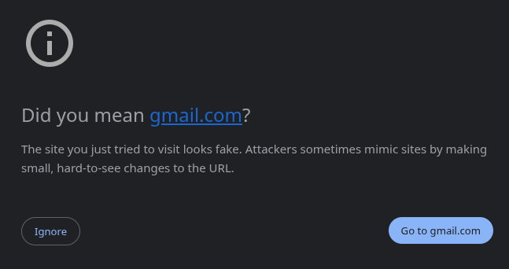

# Zephyr Cloud Feedback Assignment

This project is an Astro application deployed to Zephyr Cloud as part of a technical assignment. It serves both as a demonstration of the deployment process and as a structured feedback document detailing the experience of using Zephyr Cloud.

## 🚀 Live Deployment

The application is deployed on Zephyr Cloud's edge network. You can access the live version here:
**[View on Zephyr Cloud](https://nicolas-brandaor-gmail-com-12-zephyr-cloud-feedba-43f38f475-ze.zephyrcloud.app/)**

## 🧞 Local Development Commands

All commands are run from the root of the project, from a terminal:

| Command                   | Action                                           |
| :------------------------ | :----------------------------------------------- |
| `pnpm install`             | Installs dependencies                            |
| `pnpm dev`             | Starts local dev server at `localhost:4321`      |
| `pnpm build`           | Build your production site to `./dist/` and deploy to Zephyr         |
| `pnpm preview`         | Preview your build locally, before deploying     |

## 📝 About the Implementation

This project implements the requirements outlined in the `specs/001-zephyr-cloud-deployment.md` specification. It uses the `zephyr-astro-integration` package to achieve automated builds and deployments.

> ⚠️ **Warning regarding auto-generated URLs:** Zephyr Cloud auto-generates deployment URLs using the registered email address (e.g., converting `@gmail.com` to `-gmail-com`). This formatting can sometimes cause browsers to flag the URL as potential fraud or phishing.
>
> If you encounter a browser warning (as shown below) when visiting the live deployment, please click the **"Ignore"** or **"Proceed to ..."** button to proceed to the deployment. This is a false positive caused by the presence of `gmail-com` in the subdomain.
>
> 
